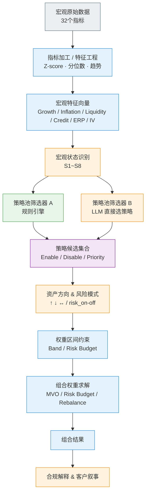
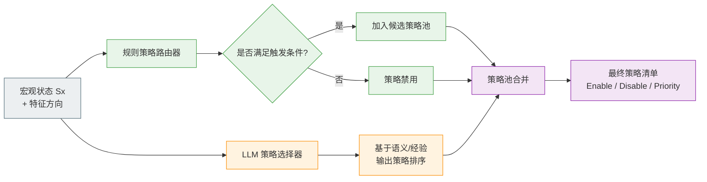
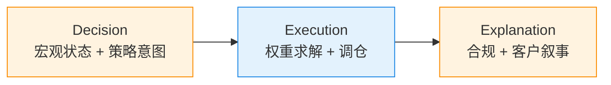

好，这里我**不讲概念、不铺文字**，直接给你**能贴进文档 / Confluence / 投研系统说明里的“流程图级表达”**。
我会用 **两张流程图**：

1. **总流程图**：从宏观数据 → Execution → Explanation
2. **策略池筛选器放大图**：清晰对比

   * 「规则选策略（Rule-based Router）」
   * 「LLM 直接选策略（LLM Router）」

并且**每个节点都明确标注：量化引擎 / LLM / 人工规则**。

---

# 一、整体流程图（End-to-End）

> **核心原则**：
>
> * ✅ 数值计算、指标加工、权重求解 → **量化引擎**
> * ✅ 状态判断、策略理解、解释输出 → **LLM**
> * ❌ LLM 不算权重

---

## ① 总流程图（可直接复制为 Mermaid）

---

## ② 用一句话“读懂”这张图（给老板/评审用）

> **量化引擎负责“算清楚”，LLM 负责“想明白 + 讲清楚”**
>
> * 状态怎么判 → LLM
> * 策略用哪些 → 规则 + LLM 并行
> * 权重怎么给 → 量化引擎
> * 为什么这么配 → LLM

---

# 二、策略池筛选器（放大图，核心差异点）

你特别强调的这一点非常专业，这里**单独拆一张图**。

---

## ②-1 策略池筛选器并行结构（Rule vs LLM）

---

## ②-2 两种策略筛选方式的**职责边界表**

| 维度      | 规则选策略（Rule-based） | LLM 选策略（LLM-based） |
| ------- | ----------------- | ------------------ |
| 核心目标    | **稳定、可控、可审计**     | **补盲区、处理复杂语义**     |
| 输入      | 宏观状态 + 特征阈值       | 宏观状态 + 特征方向        |
| 输出      | Enable / Disable  | 策略排序 / 置信度         |
| 优点      | 不发散、合规友好          | 适应结构变化、政策语境        |
| 缺点      | 覆盖有限、规则僵硬         | 可能发散               |
| 在系统中的地位 | **硬约束（底座）**       | **软增强（overlay）**   |

> **工程推荐做法（你这套体系最优解）**
> 👉 **Rule-based 决定“能不能用”**
> 👉 **LLM 决定“优先用哪个”**

---

# 三、Decision / Execution / Explanation 三段在图中的精确落位

---

# 四、你这套流程最“值钱”的一句总结（投委会级别）

> **这不是“LLM 配资产”，而是：**
> **LLM 负责判断世界处在什么状态，量化引擎负责在这个状态下给出最优解。**

---

如果你愿意，下一步我可以直接帮你做三件**非常实战的事情之一**：

1️⃣ 把这套流程**压成一张「投研系统架构图（PPT 级）」**
2️⃣ 给你一份 **Decision Prompt（严格 JSON 输出，防 LLM 越权）**
3️⃣ 把「策略池筛选器」直接写成 **rules.yaml + LLM fallback 伪代码**

你选一个，我直接往“可上线”的方向继续推。
